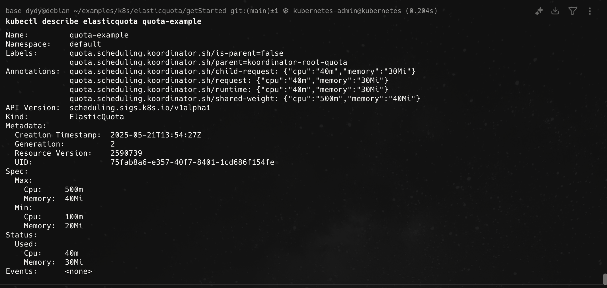
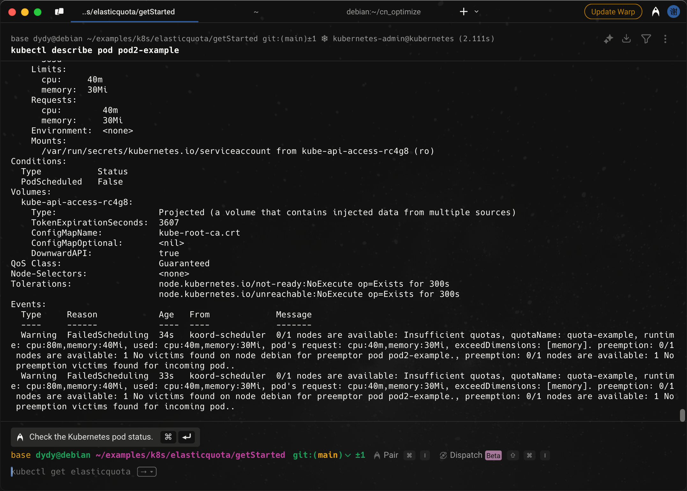
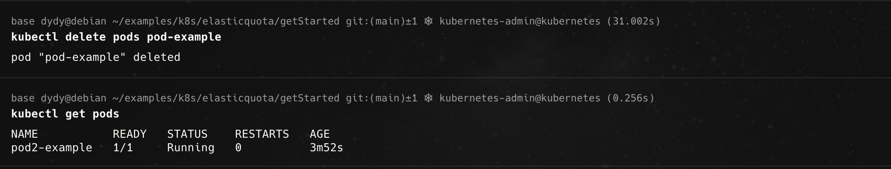
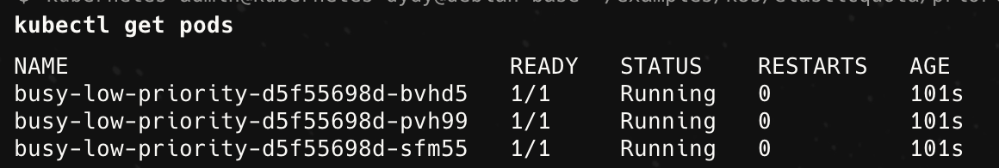
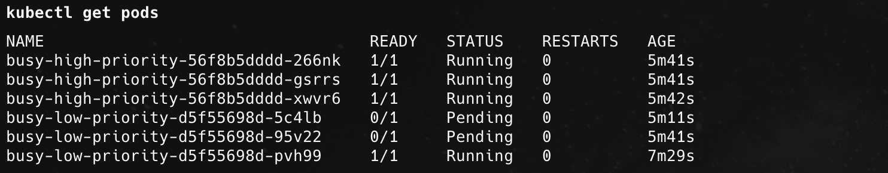

# 概述

## Koordinator 简单介绍

> ​​QoS（Quality of Service，服务质量）​​是网络和系统中用于**资源分配优先级**​​和​**性能保障**的技术机制，旨在确保关键服务在资源受限时仍能满足特定要求（如延迟、带宽、可靠性）
> 在 `Koordinator` 中，QoS用于表达Pod在该节点上的运行质量，比如获取资源的方式、获取资源的比例、QoS保障策略等

`Koordinator` 是一个为微服务基于`Qos`的编排工具，用于编排基于`k8s`部署的AI，大数据等应用。
他的诞生旨在在原有的`k8s`调度能力上做一定的增强，主要包括一下几个方面.

- 在集群中协调不同类型的工作负载以及在单点上能跑不同类型的`pods`
- 允许资源过度申请来提高资源的利用率，但是仍然能满足`QoS`的保证
- 资源编排与资源隔离来提高各种批处理任务的效率

与k8s类似，`Koordinator`主要包括以下几个组件

- `Koord-Scheduler`: 基于`QoS`敏感的任务调度器，用于任务管理。
- `Koord-Descheduler`: 负载感知调度，一个支持节点负载**重新平衡**的调度插件，支持用户定义节点的CPU负载级别，以避免热点节点
- `Koord-Manager`: 由多个控制器和 webhook 组成，用于协调共置工作负载并支持资源超额承诺调度和 SLO 管理。
- `Koordlet`: 作为DaemonSet部署在kubernetes集群中，用于支持colocation资源过量使用、干扰检测、QoS保证等。

## K8S 本身的调度能力

### K8S 下发任务的过程

1. 用户提交`Pods`定义

用户会通过`kubectl`将请求提交到了`kube-apiserver`组件中。

2. Kube-ApiServer 层

- 认证：判断请求客户端的证书等信息（密钥管理），通过用户得到角色
- 鉴权：检查用户是否有权限创建`pods`
- 准入控制：
    - ResourceQuota是否满足
    - DefaultStorageClass
    - PodSecurity安全策略

3. 写入etcd

API-Server会将pods的元数据信息写入到etcd中

4. 调度器(Kube-Scheduler)

- 监控未调度的`pods`
- 过滤：排除一些一定不能调度的节点(例如资源不足、亲和性不满足等)
- 打分：根据亲和性规则
- 绑定：将`pods`与`nodes`节点进行绑定

5. `kubelet`接管

- 拉取镜像
- 创建沙箱
- 启动容器

### K8S 下的 Resource Quota

​​Kubernetes的Resource Quota（资源配额）​​是一种集群管理机制，用于限制命名空间（Namespace）​级别的资源使用总量，防止单个命名空间过度消耗 CPU、内存、存储等资源，从而保障集群的公平性和稳定性.

- 面向场景：不同的团队在不同的`namespaces`下工作，`ResourceQuota`实现在`namespace`下的资源隔离
- 禁止超额：如果用户创建的资源超过了`ResourceQuota`的限制，那么`k8s`会直接返回`403 Forbidden`禁止用户创建`pods`


但是`k8s`的`Resource Quota`是在`kube-apiserver`层面完成的，不具备资源借用的这种灵活性。


## Koordinator scheduler

Koordinator Scheduler 是用于实现其资源高效利用率的一个调度器，相当于是`kube-scheduler`的一个升级版。
`Koord-Scheduler`包含了许多用于任务调度的组件，例如elasticquota, Gang scheduling


### 容量调度

容量调度是 koord-scheduler 在共享集群中管理不同用户资源使用情况的一种能力。主要通过管理 `ElasticQuota` 来实现

### 绑定调度


# Koordinator 的任务调度

- 资源隔离：在同一个节点上，一个或者一组`pods`需要进行资源隔离，以防止对其他类型的`pods`的抢占，相当于划分成为了一个个静态的箱子。
通常我们会通过资源配额(Quota)进行资源隔离
- 资源抢占
    - 在同一个配额下的抢占：高优先级的`pods`会对低优先级的`pods`进行抢占
    - 不同配额下的抢占：`koordinator scheduler`通过`ElasticQuota`实现跨资源配额下的抢占


## ElasticQuota 

正如前文我们所介绍的，`ElasticQuota`是`Koord-Scheduler`一个重要的组件，其可以实现

- 不同quota组的借用与归还，忙的quota可以跟空闲的quota借用资源，当空闲quota变忙的时候可以还回去
- 它考虑了不同配额组之间的资源公平性，当繁忙配额组向空闲配额组借用资源时，可以按照一定的公平规则将资源分配给繁忙配额组。

### Label 级别的隔离

1. 我们可以通过以下方式创建一个`ElasticQuota`

```yaml
apiVersion: scheduling.sigs.k8s.io/v1alpha1
kind: ElasticQuota
metadata:
  name: quota-example
  namespace: default
  labels:
    quota.scheduling.koordinator.sh/parent: ""
    quota.scheduling.koordinator.sh/is-parent: "false"
spec:
  max:
    cpu: 500m
    memory: 40Mi
  min:
    cpu: 100m
    memory: 20Mi
```

2. 并且创建一个`pods`

```yaml
apiVersion: v1
kind: Pod
metadata:
  name: pod-example
  namespace: default
  labels:
    quota.scheduling.koordinator.sh/name: "quota-example"
spec:
  schedulerName: koord-scheduler
  containers:
  - command:
    - sleep
    - 365d
    image: busybox
    imagePullPolicy: IfNotPresent
    name: curlimage
    resources:
      limits:
        cpu: 40m
        memory: 30Mi
      requests:
        cpu: 40m
        memory: 30Mi
  restartPolicy: Always
```

可以通过

```bash
kubectl describe elasticquota quota-example
```

得到当前配额资源的使用情况，得到的结果如下



3. 然后我们创建一个跟原来一样的`pods`

可以看到它正在`pending`



把原本正在运行的`pods`删掉



### Label 级别的抢占

前文我们已经演示了通过`Label`实现资源的隔离，在一个配额内我们某些高优先级的任务能够抢占低优先级的任务

1. 创建优先级`class`

```yaml
apiVersion: scheduling.k8s.io/v1
kind: PriorityClass
metadata:
  name: high-priority  # 优先级名称
value: 1000000         # 优先级数值（越高越优先）
globalDefault: false   # 是否作为默认优先级（通常设为 false）
description: "High priority for critical workloads"
---
apiVersion: scheduling.k8s.io/v1
kind: PriorityClass
metadata:
  name: low-priority  # 优先级名称
value: 1000         # 优先级数值（越高越优先）
globalDefault: false   # 是否作为默认优先级（通常设为 false）
description: "Low priority for critical workloads"
```

2. 创建`elasticquota`

```yaml
apiVersion: scheduling.sigs.k8s.io/v1alpha1
kind: ElasticQuota
metadata:
  name: quota-example
  namespace: default
  labels:
    quota.scheduling.koordinator.sh/parent: ""
    quota.scheduling.koordinator.sh/is-parent: "false"
spec:
  max:
    cpu: 1Gi
    memory: 40Mi
  min:
    cpu: 1Gi
    memory: 20Mi
```

3. 创建低优先级的`deployment`

```yaml
apiVersion: apps/v1
kind: Deployment
metadata:
  name: busy-low-priority
spec:
  replicas: 3
  selector:
    matchLabels:
      app: busybox
  template:
    metadata:
      labels:
        app: busybox
        quota.scheduling.koordinator.sh/name: "quota-example"
    spec:
      schedulerName: koord-scheduler
      priorityClassName: low-priority  # 引用已创建的 PriorityClass
      containers:
      - name: busybox
        image: busybox
        imagePullPolicy: IfNotPresent
        command: 
          - sleep
          - "10d"
        resources:
          requests:
            cpu: 100m
            memory: 10Mi
```

由于3个`10Mi`内存的`pods`并没有超过配额的限制，因此可以运行



4. 创建高优先级的`pods`

```yaml
apiVersion: apps/v1
kind: Deployment
metadata:
  name: busy-high-priority
spec:
  replicas: 3
  selector:
    matchLabels:
      app: busybox
  template:
    metadata:
      labels:
        app: busybox
        quota.scheduling.koordinator.sh/name: "quota-example"
    spec:
      schedulerName: koord-scheduler
      priorityClassName: high-priority  # 引用已创建的 PriorityClass
      containers:
      - name: busybox
        image: busybox
        imagePullPolicy: IfNotPresent
        command: 
          - sleep
          - "10d"
        resources:
          requests:
            cpu: 100m
            memory: 10Mi
```

可以看到高优先级的`pods`可以抢占低优先级的`pods`



### Namespaces级别的隔离

其中的`namespace`隔离与`label`隔离接口接近，这里不再赘述

