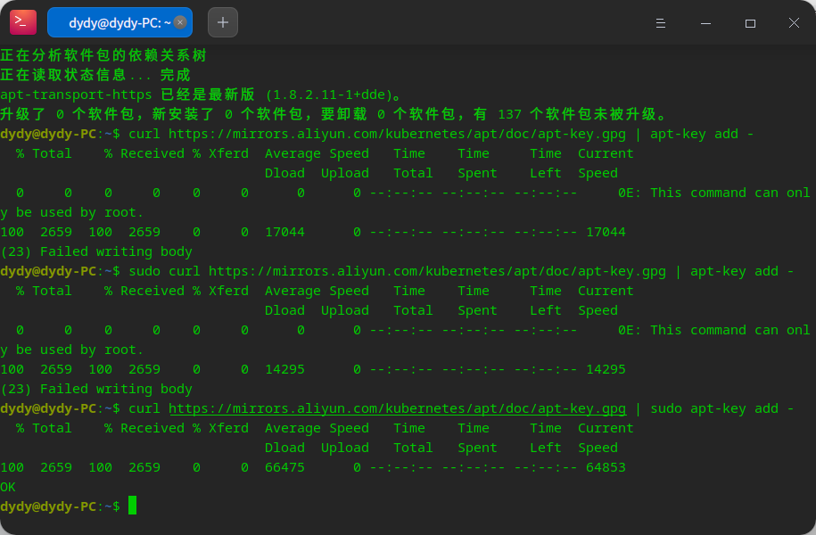

# Kubernetes 概述

- k8s 官网：[https://kubernetes.io/](https://kubernetes.io/)

Kubernetes 又被叫做 k8s，是一个用于自动化部署、自动扩容以及容器化应用管理的开源系统

# `kubernetes` 搭建

## 准备工具

使用阿里云的镜像构建 k8s

```bash
sudo apt-get update && sudo apt-get install -y apt-transport-https
curl https://mirrors.aliyun.com/kubernetes/apt/doc/apt-key.gpg | sudo apt-key add -
```



之后将阿里云的镜像地址写到 `sources.list` 当中

```bash
sudo vim /etc/apt/sources.list.d/kubernetes.list

# 写入下列内容
deb https://mirrors.aliyun.com/kubernetes/apt/ kubernetes-xenial main
```

退出后更新软件包，下载 k8s

```bash
sudo apt-get update
sudo apt-get install -y kubelet kubeadm kubectl
```

如果需要安装特定版本的k8s，则

```bash
sudo apt-get install -y kubelet=1.27.0-00 kubeadm=1.27.0-00 kubectl=1.27.0-00
```
## 集群启动

搭建后可以通过

```bash
sudo kubeadm init
```

启动容器可能会遇到诸多问题，见[问题`kubeadm init`](#kubeadm-init)

容器启动成功后，运行命令提示的三条命令

```bash
sudo mkdir -p .kube/config
sudo cp -i /etc/kubernetes/admin.conf .kube/config
sudo chown $(id -u):$(id -g) .kube/config
```

## 网络插件

启动容器后可以通过`kubectl get pods -n kube-system`观察到几个`pods`能够顺利运行，除了两个`core-dns`一直在`pending`，所以这个时候需要安装网络插件，以下选择`calico`

```bash
wget https://calico-v3-25.netlify.app/archive/v3.25/manifests/calico.yaml
```

下载后

```bash
kubectl apply -f calico.yaml
```

## 运行时配置

然后等一会儿，可以通过`kubectl get pods -n kube-system`看到`pods`的相关信息。等到插件成功变为`running`之后，通过

```bash
kubectl get nodes
```

可以看到控制节点应为`ready`状态，如果没有，多半是`containerd`的配置问题

```bash
sudo vim /etc/cni/net.d/10-containerd-net.conflist

# 写入以下内容
{
 "cniVersion": "1.0.0",
 "name": "containerd-net",
 "plugins": [
   {
     "type": "bridge",
     "bridge": "cni0",
     "isGateway": true,
     "ipMasq": true,
     "promiscMode": true,
     "ipam": {
       "type": "host-local",
       "ranges": [
         [{
           "subnet": "10.88.0.0/16"
         }],
         [{
           "subnet": "2001:db8:4860::/64"
         }]
       ],
       "routes": [
         { "dst": "0.0.0.0/0" },
         { "dst": "::/0" }
       ]
     }
   },
   {
     "type": "portmap",
     "capabilities": {"portMappings": true},
     "externalSetMarkChain": "KUBE-MARK-MASQ"
   }
 ]
}
```

然后重启一下`containerd`

```bash
sudo systemctl restart containerd
```

## 排除污点

获取配置中的污点信息并把污点排除掉

```bash
kubectl get nodes -o yaml | code -
kubectl taint nodes <node_name> <taint_name>-
```


# Kind

## 在集群中加载镜像

在一个已经运行的集群中加载一个 `docker-image`，`dockerfile` 如下

```dockerfile
FROM ubuntu:latest

COPY ${pwd}/code /code

RUN apt update && apt install -y python3-pip && apt-get clean

RUN pip install flask

CMD [ "sh", "-c", "python3 /code/app.py"]
```

`code` 里头运行了一个简单的 `flask` 应用

```python
from flask import Flask

app = Flask(__name__)

@app.route("/")
def hello_world():
    return "<p>Hello World!</p>"

if __name__ == "__main__":
    app.run(host="0.0.0.0",port=8080,debug=True)
```

加载到集群中

```bash
kind load docker-image flask-image:latest
```


```shell
docker exec -it kind-control-plane crictl images
```


# 问题

## `kubeadm init`

```bash
[WARNING Hostname]: hostname "dydy-pc" could not be reached
[WARNING Hostname]: hostname "dydy-pc": lookup dydy-pc on 210.28.129.251:53: no such host
```

修改 `/etc/hosts`，将 `localhost` 后面添加自己的电脑主机地址即可

---

```bash
[ERROR CRI]: container runtime is not running: output: time="2023-09-19T09:03:23+08:00" level=fatal msg="validace connection: CRI v1 runtime API is not implemented for endpoint \"unix:///var/run/containerd/containerd.sock\": rpc error: code = Unimplemented desc = unknown service runtime.v1.RuntimeService"
```

[Kubernetes 环境搭建](https://yxrt3ryg3jg.feishu.cn/docx/Xru9d9V7MoSk5kxsFJXcqtUjn2c#part-RfVPd1aHPoNdExx7ppqcVT9Gn6f)

---

- 问：启动后`kubectl`任何命令提示连不上`kube-apiserver`

- 答：代理问题。启动后可以`unset http_proxy https_proxy`或者将`kube-apiserver`的IP地址添加到`no_proxy`里头


---


## `kubeadm config images pull`

```bash
failed to pull image "registry.k8s.io/kube-apiserver:v1.28.2": output: E0919 09:32:01.239971   35982 remote_image.go:171] "PullImage from image service failed" err="rpc error: code = Unavailable desc = connection error: desc = \"transport: Error while dialing dial unix /var/run/containerd/containerd.sock: connect: permission denied\"" image="registry.k8s.io/kube-apiserver:v1.28.2"
time="2023-09-19T09:32:01+08:00" level=fatal msg="pulling image: rpc error: code = Unavailable desc = connection error: desc = \"transport: Error while dialing dial unix /var/run/containerd/containerd.sock: connect: permission denied\""
, error: exit status 1
```

生成默认配置文件

```bash
kubeadm config print init-defaults > init.default.yaml
```

修改默认配置文件
