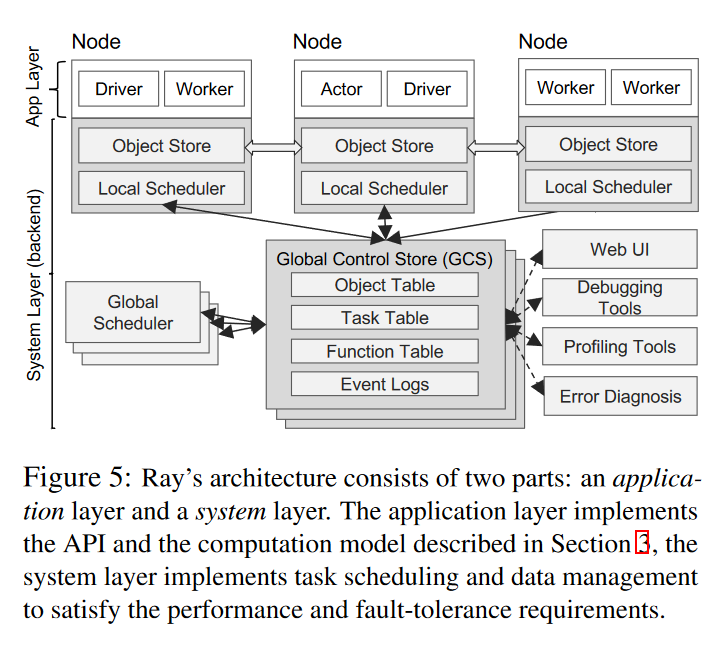
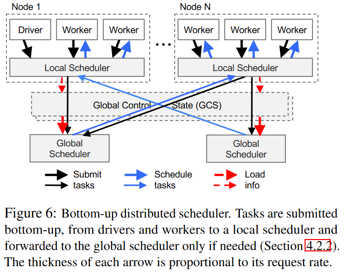
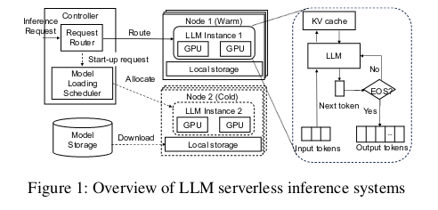
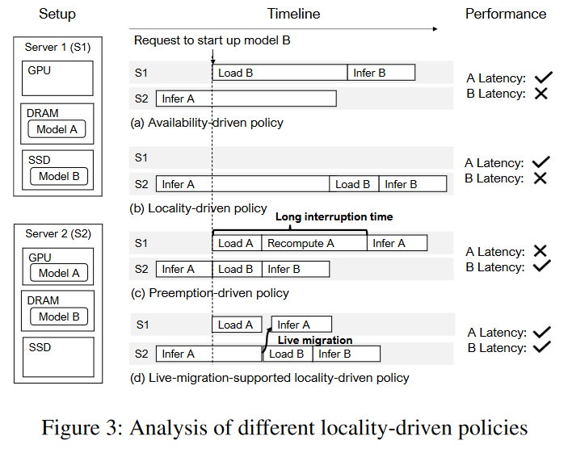
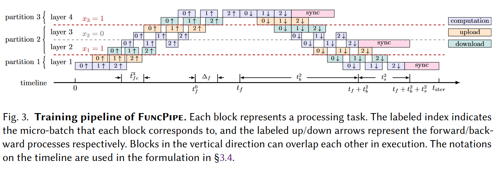
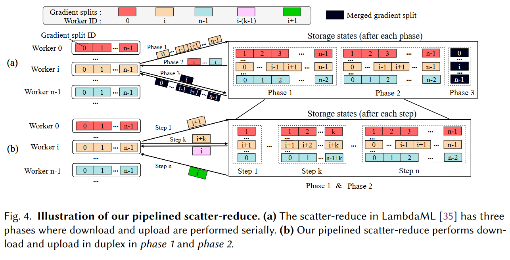
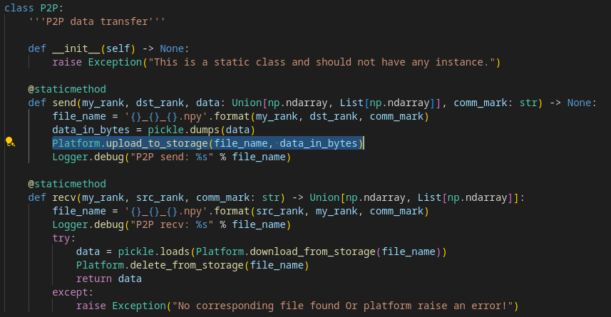
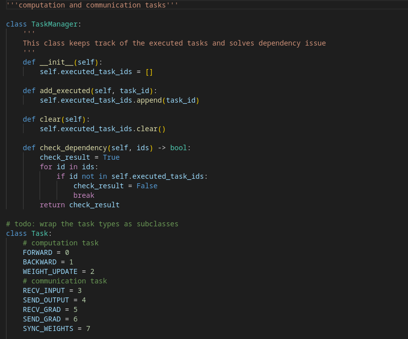

# Serverless 智能化应用

# 研究问题

- 底层系统资源的配置（GPU，内存大小配置等）智能适应 or 人工设定
- 有状态函数的快速存储机制
- 容错

  - 执行顺序：多个无状态函数可能会乱序执行，导致结果也是乱序
  - 执行状态：有状态函数的执行可能会断掉，需要能够恢复

# 参考文献

## [Cirrus: a Serverless Framework for End-to-end ML Workflow](https://dl.acm.org/doi/abs/10.1145/3357223.3362711)

代码仓库：[https://github.com/ucbrise/cirrus](https://github.com/ucbrise/cirrus)

### 解决问题

- 解决 ML 过程资源配置和管理的问题

  - 传统的 `workflow` 拥有多个阶段，每一个阶段的计算都是异构的
  - 计算的异构使得机器学习用户很难正确配置和管理资源，并且在实践中，这会构成重大负担，经常导致过度配置并损害用户生产力。
- Serverless 可以很好的管理资源

  - 但是很难适应 Serverless
- `Cirrus` 通过 Serverless 的框架对 ML 做资源的适配管理

  - 轻量级的工作运行时，为 ML 人员找到最适合的资源配置
  - 节省了配置大量内存或存储的成本
    - (a) 来自远程存储的流式训练小批量数据；
    - (b) 重新设计分布式训练算法以在无服务器环境中稳健运行
  - 采用无状态的 worker 架构，使系统能够有效地处理频繁的 worker 离开和到达作为预期行为。

### 问题描述

- ML Workflow 带来两个问题

  - 过度配置：如果使用虚拟机做资源的配置，配置的复杂性就会导致过度配置
  - 资源管理：管理的复杂性降低了交互式和迭代用例
- Serverless 本身的挑战

  - 内存以及存储过小：利用无服务器计算的主要挑战是与 lambda 函数相关的本地资源限制（内存、CPU、存储、网络）非常小
  - 低带宽以及缺少 P2P 通信：最新的 Lambda 也只有 60MB 的带宽；缺少通信策略，用于数据中心机器学习的常见通信策略，例如树形结构或环形结构的 AllReduce 通信，在此类环境中受到限制
  - 启动时间短暂并且不可预测：Lambda 函数的生命周期很短，并且其启动时间变化很大。这意味着在训练期间，lambda 会在不可预测的时间开始，并可能在训练中间结束。这需要 lambda 的 ML 运行时能够容忍工作人员的频繁离开和到达。
  - 缺少快速共享存储的功能：由于 lambda 函数彼此不能直接通信，因此需要快速的共享存储。但是 ML 训练对数据的性能要求非常高，不能有太大的延时

### 系统设计

#### 系统架构图

#### 模块

- Python 前端：提供了一个底层抽象系统资源的高级接口

  - 预处理模块：该子模块允许不同类型的数据集转换：最小-最大缩放、标准化和特征哈希。
  - 训练模块：可以使用随机梯度下降来训练的 ML 模型。
  - 超参数优化：允许用户对给定的参数集运行网格搜索。
- 客户端后端：解析训练数据并将其加载到 S3，在 lambda 上启动 Cirrus 工作程序，管理分布式数据存储，跟踪计算进度，并在计算完成后将结果返回到 Python 前端。
- 工作运行时：Cirrus 提供了一个运行时，它封装了系统支持的不同计算之间共享的所有函数
- 分布式数据存储：

  - 低延迟：将数据存储部署在云虚拟机中
  - 可扩展：Cirrus 包括以下机制：(1) 分片存储、(2) 高度多线程、(3) 数据压缩、(4) 梯度过滤器和 (5) 异步通信。
  - 强接口

#### 端到端的 ML 阶段

- 数据加载与预处理

  - 假设数据已经被全局存储（例如 S3）Cirrus 将其转为二进制数据
  - 使用 Map-Reduce 模式。
- 模型训练

  - 分布式 SGD 算法
  - 每个 `worker` 运行 Lambda 函数并负责迭代计算梯度步骤。每个梯度计算都需要两个输入：一个小批量和最新的模型
  - 对于每次迭代，每个工作人员都会计算一个新的梯度。然后将该梯度异步发送到数据存储 (send_gradient_X ) 以更新模型。
- 超参数优化

  - 典型的做法是在多维参数空间上执行网格搜索。通常让网格搜索完全运行完成并对结果进行后处理以找到最佳配置（过度配置）
  - 随着时间的推移，Cirrus 通过提供超参数搜索仪表板来消除这种过度配置的情况
  - 因此，Cirrus 提供 (a) 用于启动超参数搜索的 API 和执行后端，(b) 用于监控模型精度收敛的仪表板，(c) 终止单独调整实验并节省超额配置成本的能力。

### 实现方式

#### Python 前端

- 抽象了有关开发者的细节
- 通过 API 参数覆盖内部配置参数

#### Client 后端

- 将前端的算法部署到 Lambda 上并抽象了管理

  - 内部保存了与 Lambda 函数的连接列表
- 使用线程池响应请求

  - Lambda API 的特殊性

#### 分布式数据存储

- 多线程服务器，将任务分配给多个核心

  - 目的：高效地更新模型
- 对传入/传出存储的梯度和模型实施数据压缩

  - 目的：减少网络带来的瓶颈
- 通过发送和接收稀疏梯度和模型数据结构来优化通信

#### Worker 运行时

- ML 计算的通用抽象
- 用于访问训练数据、参数模型和中间结果的数据原语。

## [Ray: A Distributed Framework for Emerging AI Applications](https://www.usenix.org/conference/osdi18/presentation/moritz)

### 解决问题

- 需求：下一代的 AI 需要持续与环境交互，对性能和复杂性有要求

  - 必须支持细粒度计算
  - 支持时间和资源的合理使用的异构性
  - 必须支持动态执行，因为模拟或与环境交互的结果可能会改变未来的计算
- 贡献：Ray，一个通用集群计算框架，支持 RL 应用程序的模拟、训练和服务

  - 该框架统一了新兴 RL 应用程序的训练、模拟和服务必要组件
  - 抽象任务并行以及 Actor 计算
  - 控制状态存储在分片元数据存储中，所有其他系统组件都是无状态的。
  - 自下而上的分布式调度策略

### 问题描述

- 针对需求

  - 细粒度、异构计算
    - 计算时间可能几秒钟到几小时
    - 硬件资源可能也不一样
  - 灵活的计算模型
    - 无状态：无状态计算可以在系统中的任何节点上执行，这使得在需要时可以轻松实现负载平衡和计算到数据的移动
      - 适合细粒度模拟和数据处理
    - 有状态：状态计算非常适合实现参数服务器、对 GPU 支持的数据执行重复计算或运行不公开其状态的第三方模拟器
  - 动态执行
    - 计算完成的顺序并不总是事先知道（例如，模拟完成的顺序），并且计算的结果可以决定未来的计算
- 对要实现的目标

  - 要每秒处理数百万个任务
  - 集成现有的模拟器以及机器学习框架

### 编程与计算模型

#### 编程模型

- `Tasks`：表示在无状态工作线程上执行远程函数

  - 并行：当调用远程函数时，会立即返回表示任务结果的 future
  - 协作：可以使用 ray.get() 检索 Future，并将其作为参数传递给其他远程函数
  - 无状态：对不可变对象进行操作，具有幂等性，具备容错能力
- `Actor`：表示有状态的计算

  - `handle`：可以被传递给其他的 `Actor`，便于远程调用

- 为了处理具有异构持续时间的并发任务，引入了 ray.wait()，它等待前 k 个可用结果，而不是像 ray.get() 那样等待所有结果。
- 为了处理资源异构任务，使开发人员能够指定资源需求，以便 Ray 调度器能够有效地管理资源。
- 为了提高灵活性，启用**嵌套远程函数**，这意味着远程函数可以调用其他远程函数。这对于实现高可扩展性也至关重要，因为它允许多个进程以分布式方式调用远程函数。

#### 计算模型

- 任务图计算：输入满足条件时自动触发

  - 两种节点类型
    - 数据节点
    - 任务节点
  - 两种边
    - 数据边：捕捉数据节点和任务节点之间的依赖关系
      - 若 D 是 T 的输出，那么从 T 到 D 就有一条连边
    - 控制边：捕捉两个有调用关系的任务节点之间的计算依赖关系
      - 若 T1 调用 T2，那么 T1 到 T2 有一条边
- Actor

  - 新增状态边
    - 若 Mj 方法在 Mi 方法之后，那么 Mi 到 Mj 有一条边
    - 所有对一个 Actor 的方法的调用顺序通过状态边连接
- 有状态边帮助我们将参与者嵌入到无状态任务图中，因为它们捕获共享参与者内部状态的连续方法调用之间的隐式数据依赖关系

### 系统架构

- 应用层：实现 API
- 系统层：提供高拓展性以及容错性

#### 应用层

- `Driver`：运行用户程序的进程
- `Worker`：一个调用远程函数或 Task 的无状态进程

  - 由系统层分配任务
  - 当远程函数被声明时，函数被分配到所有的 `Worker`
- `Actor`：有状态进程，在调用时仅执行他所公开的方法

  - `Actor` 必须被显式实例化
  - 通过之前方法的执行结果序列化地执行方法

#### 系统层

##### 全局控制存储（GCS）：维护系统的控制状态

- 具有发布-订阅的键值存储

  - 使用分片来实现扩展
  - 使用每个分片链复制来提供容错能力
- 容错能力

  - 需要维护沿袭信息：持久沿袭信息组件与其他组件分离，每个组件独立扩展
- 保持低延迟

  - 最大限度的减少任务调度的开销
  - 任务分配与任务调度分离：对象元数据存储在 GCS 中而不是调度程序中
- 使系统中的每个其他组件都是无状态的

##### 自下而上的分部署调度器：两级分层调度器

- 全局调度器

  - 考虑每个节点的负载和任务的约束来做出调度决策
  - 选择提供最短估计等待时间的节点
  - 通过心跳获取每个节点的队列大小和节点资源可用性，以及来自 GCS 的任务输入的位置及其大小。
  - 如果全局调度程序成为瓶颈，可以通过 GCS 实例化更多共享相同信息的副本
- 每个节点本地调度器

  - 每个节点创建的任务首先通过本地调度器
  - 本地调度器在本地调度程序，直到节点过载
  - 当本地调度器不想管了，就交给全局调度器

##### 内存中分布式对象存储

在每个节点上，通过共享内存实现对象存储。这允许在同一节点上运行的任务之间进行零拷贝数据共享。作为数据格式，使用 Apache Arrow

- 对象存储：

  - 如果任务的输入不是本地的，则输入会在执行之前复制到本地对象存储。
  - 此外，任务将其输出写入本地对象存储
- 低延迟

  - 将整个对象保持在内存中，通过 LRU 机制写入磁盘
- 容错

  - 通过沿袭重新执行来恢复任何所需的对象。
  - 在初始执行时，GCS 存储的沿袭信息追踪着有状态的 Actor 以及无状态的 Tasks
  -

## [ServerlessLLM: Locality-Enhanced Serverless Inference for Large Language Models](https://arxiv.org/abs/2401.14351)

### 解决问题

- 一个局部性增强的用于大模型推理的 Serverless 系统

  - 利用 GPU 服务器上可用的存储和内存设备的大量容量和带宽，从而减少昂贵的远程检查点下载并实现高效的检查点加载
- 主要贡献

  - LLM 检查点快速加载系统：利用**加载优化检查点格式设计**以及**高效的多层检查点加载系统**
    - 一个新的加载优化检查点，支持顺序、基于块的读取和高效的张量寻址
    - 多层次检查点加载系统，通过内存中**数据块池**，具有**高效内存复制的数据路径，**多阶段数据加载流水线
  - 本地驱动的 LLM 推理实时迁移：允许 ServerlessLLM 有效地实现局部驱动的服务器分配，同时保持正在进行的 LLM 推理的低延迟
    - 基于 token 的迁移决定了迁移到另一个服务器的最小 token 集
    - 二阶段迁移保证了 LLM 推理迁移时避免影响在线推理服务
  - 位置感知服务器分配：使 ServerlessLLM 能够评估集群中每个服务器的状态，并有效地安排模型启动时间以利用本地检查点放置
    - 集成了用于估计**从不同层次加载检查点的时间**以及**迁移到另一个服务器的时间**的模型

### 背景知识

- Serverless LLM 推理系统

  - 接收一个用户的输入请求
  - 基于之前生成的 token 迭代式生成 token
  - 每轮迭代使用一个 KV 存储来加速下一代的 token 生成
- 传统的 Serverless LLM 推理系统

  - **请求路由器**将请求转发到已经在运行 LLM 推理服务的实例上（称为热节点）或者让**模型加载器**创建更多的实例节点
  - **模型加载器**从未分配节点池以及冷节点池分配节点来启动一个新的 LLM 推理服务

### 问题描述

#### 问题背景

- 大模型推理服务

  - 需要大量的 GPU 资源
  - 延迟时间很难估计：取决于他们的输出长度
  - 大量的 GPU 资源被消耗：LLM 提供商需要托管大量的 LLM
- 为了减少 GPU 消耗

  - 开发者上传他们的 checkpoint -> 包括模型执行文件以及模型参数
  - 接收请求后将其**转发到已经加载好模型的 GPU** 中
  - 使用无服务器的方法可以充分利用共享 GPU 资源，并且开发者不需要为 GPU 长时间运行付费
- Serverless 保持 LLM 的 promise 时有显著的延迟

  - 数据可大可小
  - 数据异构
  - 利用**多层的存储架构**进行检查点的本地存储，并充分利用存储带宽
- 上述设计带来的现实问题

  - 如何优化检查点加载来充分利用存储带宽
  - 选择已经加载好的服务器可能会带来 GPU 服务器的争用，这部分争用不知道何时结束
  - 当接收到请求需要加载一个模型的时候，应该如何保证模型启动的最短时间

#### 问题定义

- 从模型存储库中下载模型检查点的代价大

  - 从 S3 下载一个 130GB 的模型大概需要 26 秒的时间
- 从存储设备加载模型检查点的代价大

  - 使用 PyTorch 加载 OPT-30B 到 4 块 GPU 花费 34s
  - 加载 LLaMA-2-70b 到 8 块 GPU 花费 84s

#### 当前解决方案

- 超额订阅模型实例：搞多点 GPU，太贵了
- 在本地内存中缓存模型：小模型可以这么干，大模型经常 cache miss
- 部署额外的存储服务器：部署额外存储服务器和高带宽网络的成本通常会产生巨额费用

### 快速 LLM 检查点加载

#### 加载优化的检查点

- 检查点通常包含

  - 定义模型架构的模型执行文件
  - 模型参数文件，将参数的二进制数据存储在 LLM 中
- ServerlessLLM 将检查点转化一下

  - 支持基于块的读取：仅包含模型的二进制数据，不包含张量形状等元数据
  - 支持高效的张量寻址：创建一个索引文件，将张量名称映射到 GPU id、偏移量和大小的元组，以便于高效恢复张量
- ServerlessLLM 有一个内服务模型管理器来加载优化后的检查点

  - 从 GPU 上分配内存并预加载检查点的二进制数据
  - 模型需要时可以有效地获取 GPU 的内存地址
    - 通过一个**加载函数**，通过每个 GPU 的基地址以及偏移量

#### 高效的多层次检查点加载

- 内存数据块池

  - 使用并行化 PCI 链路
  - 支持应用级别的控制：提供 API 对内存的分配以及释放的控制
  - 减少内存碎片
- 高效数据路径（data path）

  - 利用直接文件访问？
  - 利用固定内存：使用固定内存消除 DRAM 和 GPU 之间的冗余数据复制

### 实时迁移的本地驱动 LLM 推理

#### 必要性

- **可用性驱动策略**选择 GPU 可用的服务器 1，这使得没有被加载进来的 B 受到影响，而 A 不受影响
- **本地驱动策略**选择了已经加载好模型的服务器 2，这也让 B 的加载受到影响，并且服务器 1 浪费了
- **抢先驱动策略**让 B 打断 A 的推理过程，并且让 A 在服务器 1 上跑，这样让 A 被打断了
- **实时迁移的本地驱动策略**让服务器 1 预加载 A 的模型，A 加载好了就把 A 迁移过去，这样对 AB 都好

#### 实时迁移过程

- 简单的想法是创建快照并迁移

  - 但是这样太慢了
- 使用**基于 Token 的迁移**

  - 前提：在推理过程中，模型检查点是只读的，并且可以低延迟地从令牌重新计算 KV 缓存
  - 所以当模型检查点的副本在另一台服务器上，就可以在那里启动模型并传输令牌
  - 传输的过程就变成了传输整数数组（小且快）
- 避免令牌传输时中断推理，使用**二阶段传输**

  - 阶段 1：目标服务器使用中间令牌重新计算 KV 缓存
  - 阶段 2：目标服务器接收发送中间令牌后生成的剩余令牌
  - 具体过程
    - **模型加载管理器**让**目标服务器**加载模型 A，如果目标服务器上有空闲实例 A 则跳过此步骤
    - 加载后该**管理器**向源服务器发送关于目标服务器的**模型迁移请求**
    - 如果源服务器推理未完成，就将推理过程的令牌的**恢复请求**发送到目标服务器
    - 目标服务器根据接收的**恢复请求**中的令牌重新计算 KV 缓存
    - 当恢复请求结束后，源服务器停止推理，使用所有令牌和“已迁移”标志回复请求路由器。
    - 管理器完成迁移，将源服务器的模型 A 卸载并开始推理模型 B
    - **请求路由器**检查推理响应中的标志。如果是“迁移”，则请求路由器将其路由表中的 src 服务器替换为 dest 服务器，并将所有令牌发送到 dest 服务器以继续推理

### 本地感知的服务器分配

#### 模型调度器设计

- 模型加载时间估计器

#### 估计模型加载时间

- 三个要素
  - 排队时间（q），即模型在服务器加载任务队列中的等待时间。
  - 模型大小 (n)、模型大小（以字节为单位）或其在多 GPU 推理场景中的模型分区
  - 带宽 (b)，将模型从存储传输到 GPU 的可用速度

#### 估计模型迁移时间

## [FuncPipe: A Pipelined Serverless Framework for Fast and Cost-Efficient Training of Deep Learning Mod](https://dl.acm.org/doi/abs/10.1145/3570607)

### 解决问题

- 深度学习在 Serverless 平台上的训练有障碍

  - Serverless 基础设施的资源限制
  - 深度学习模型对内存和带宽的爆炸性需求
- FuncPipe 贡献

  - Serverless 训练的流水线框架：利用模型分区来弥合上述的差距
  - 流水线的 scatter-reduce 算法：提高通信效率
  - 使用混合整数二次规划（MIQP）：制定模型划分和资源分配的协同优化问题

### 背景知识

- Serverless 训练的好处

  - 不用配置虚拟机，不用管理集群
  - 按需付费
  - 资源弹性扩充
- DL 训练的通信方式

  - 集中式：参数服务器。Worker 给参数，服务器返还参数。例如 Cirrus
  - 去中心化：基于某种协议（例如 all-reduce 或者 scatter-reduce）

### 问题描述

- Serverless 通信能力不能满足 DL 训练的通信需求

  - 传输的数据量少（带宽低）
  - 延迟高（不具备直接通信能力，依赖于中间件）
- Serverless 内存占用小
- 问题定义：

  - 如何划分深度学习模型
    - 之前的工作都是基于静态的资源，只追求最大的吞吐量
  - 如何为每个 Serverless 函数分配资源

### 系统设计

#### 系统架构

- 启动组件
- 运行时组件
- 客户端 API

  - 设置、部署、监控训练

#### 训练流水线

- 执行同步训练，避免潜在的收敛和准确性问题

  - 数据被分为微批次
    - 所有的微批次都会经过每个分区进行前向计算
    - 所有前向计算完成后，微批次以相反的顺序进行反向计算
- 每个 Worker 有两种任务

  - 通信任务
    - 分为上行、下行以及同步
    - 上行下行通过云存储完成，同步在处于同一个配置的 Worker 在一轮迭代后执行
  - 计算任务
- 类似工作：GPipe。不同点：将通信任务视为管道阶段并将其与计算任务重叠

#### 分散减少流水线(scatter-reduce)

- 流水线存储的分散减少算法

  - 将梯度划分为 n 个分割，利用所有 worker 的计算资源进行梯度聚合，那么每个 worker 符合合并一个 split
  - 三个阶段
    - 每个 worker 将其他 worker 负责的 n-1 个梯度分割上传到存储
    - 第 i 个 worker 将其他 worker 上传的第 i 个 Worker 聚合并计算聚合后的梯度
    - 每个 worker 上传合并后的分割并计算所有其他合并的分割
- 改进后的分散减少算法

  - n 个步骤
    - 第 1 步，第 i 个 worker 上传 i+1 分割
    - 第 k 步，第 i 个 worker 上传 i+k 分割，并下载 i-(k-1)
    - 第 n 步，第 i 个 worker 已经上传了所有分割，并且从下一个 worker 获得梯度

#### 模型划分与资源分配的协同优化

（没看懂）

### 系统实现

- 管道任务堆叠：通过 DAG 图保证数据并行

  - 不同类型的任务用不同的资源需求
  - 将他们组合成一个 DAG 并通过任务执行器进行管理
  - 每个节点都有一个 ID 并且有一堆依赖的节点 ID，当依赖资源满足时可以保证恰好一次进行
- 基于存储的通信

  - 不同分区的发送和接受
  - 分区副本之间的分散减少
  - 通信使用 Python pickle 序列化并上传到存储桶
- 局限性

  - 单个层次内存过大会把 Serverless 函数弄爆
  - 可能得解决方案是张量并行
  - 使用张量并行性增加了所提出的协同优化方法的复杂性，因为额外的决策维度极大地扩展了搜索空间

### 部分代码实现

## [ElasticFlow: An Elastic Serverless Training Platform for Distributed Deep Learning](https://dl.acm.org/doi/10.1145/3575693.3575721)

### 解决问题

- 一个用于深度学习的弹性的 Serverless 训练平台

  - 用户只需要指定作业的深度神经网络模型和超参数，无需指定 GPU 的数量
  - 用户指定作业的 ddl，但不指定占用 GPU 的时间量
-
